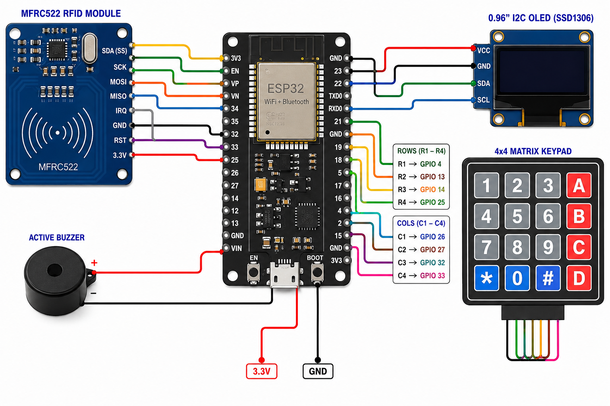
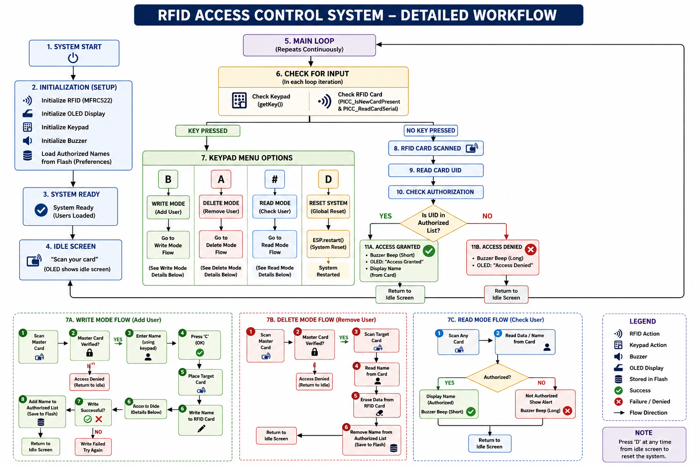

# RFID-Based Attendance Management System using ESP32

An IoT-based attendance management system that uses RFID technology and ESP32 to identify registered students and record their attendance digitally.

The system combines an MFRC522 RFID reader, 4×4 keypad, OLED display, buzzer, Wi-Fi, ESP32 flash memory, and Google Sheets for attendance management.

##  Features

- RFID-based student identification
- Student registration and deletion
- Attendance recording through Google Sheets
- Wi-Fi connectivity
- OLED status display
- Buzzer feedback
- Master RFID card for administrative functions
- Student data stored in ESP32 flash memory
- 4×4 keypad for system control
- Continues local operation when Wi-Fi is unavailable
- Supports up to 10 registered students

##  Hardware Components

| Component | Quantity |
|---|---:|
| ESP32 | 1 |
| MFRC522 RFID Reader | 1 |
| RFID Cards/Tags | As required |
| 4×4 Keypad | 1 |
| OLED Display (SSD1306) | 1 |
| Buzzer | 1 |
| Jumper Wires | As required |
| Breadboard | 1 |

##  Circuit Diagram

The circuit connects the ESP32 with the RFID reader, OLED display, keypad, and buzzer.



##  System Workflow



### Working Process

1. The ESP32 initializes all connected components.
2. The system attempts to connect to the configured Wi-Fi network.
3. The OLED displays the system status and waits for an RFID card.
4. The student scans their RFID card.
5. The MFRC522 RFID reader reads the card.
6. The ESP32 reads the student information stored on the card.
7. The information is compared with the registered student list.
8. If the student is registered, the attendance status is displayed.
9. The buzzer provides confirmation.
10. The student's name, RFID UID, and attendance status are sent to Google Sheets through Wi-Fi.
11. If the card is not registered, the system displays an appropriate status.

##  Keypad Functions

| Key | Function |
|---|---|
| `A` | Delete registered student |
| `B` | Register/Add student |
| `#` | Read student information |
| `C` | Confirm entered name |
| `*` | Clear input |
| `D` | Reset student data |

A master RFID card is used to access the administrative functions.

##  Pin Configuration

### MFRC522 RFID Reader

| MFRC522 Pin | ESP32 Pin |
|---|---|
| SDA / SS | GPIO 5 |
| RST | GPIO 22 |
| MOSI | SPI MOSI |
| MISO | SPI MISO |
| SCK | SPI SCK |
| 3.3V | 3.3V |
| GND | GND |

### OLED Display

| OLED Pin | ESP32 Pin |
|---|---|
| SDA | GPIO 21 |
| SCL | GPIO 2 |
| VCC | 3.3V |
| GND | GND |

### 4×4 Keypad

**Rows**

```text
R1 → GPIO 4
R2 → GPIO 13
R3 → GPIO 14
R4 → GPIO 25
